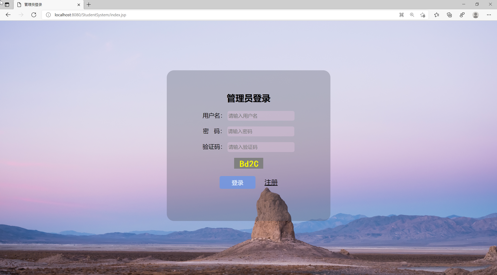
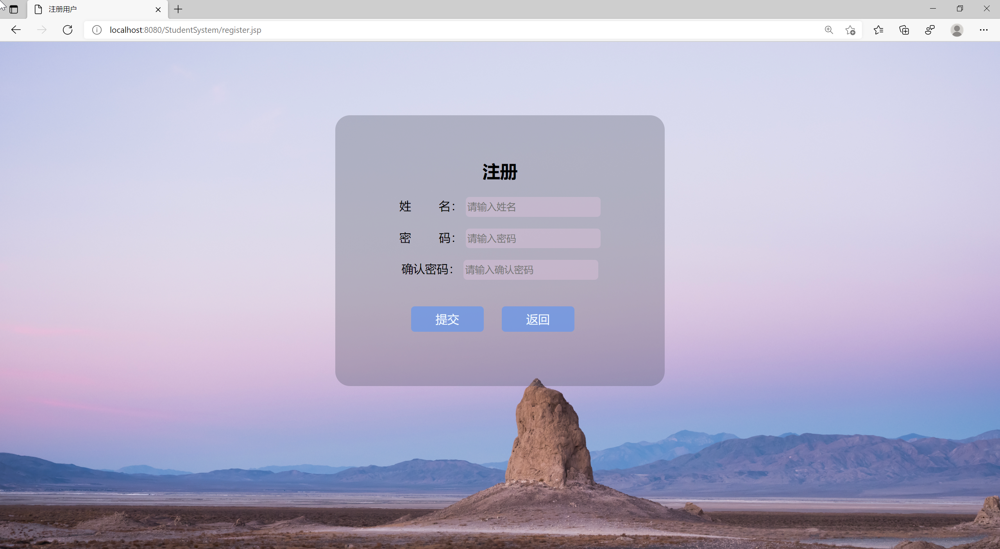
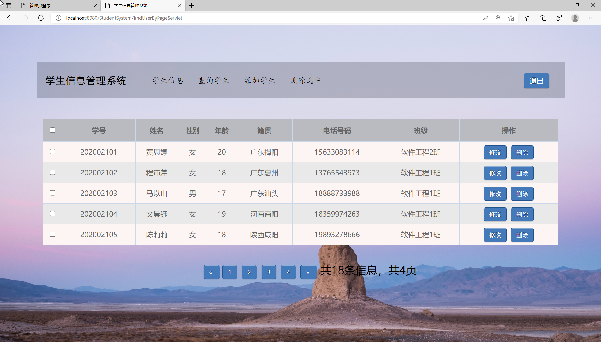
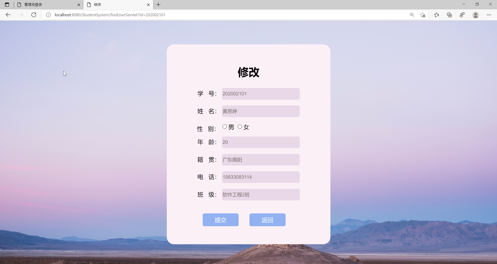
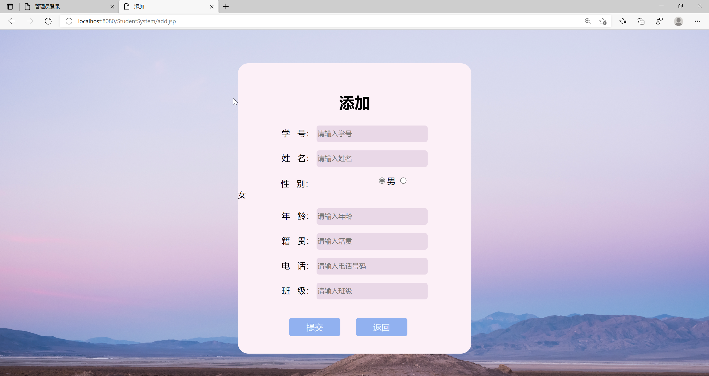
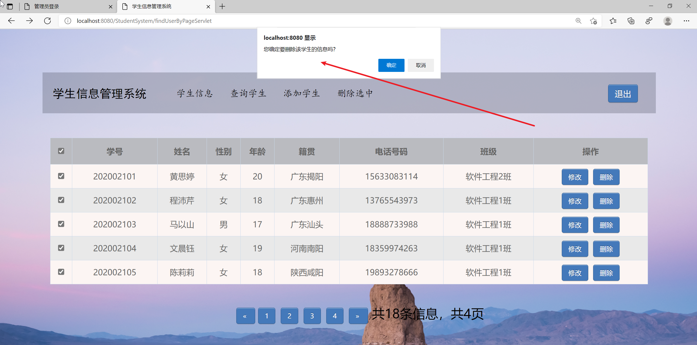

<h1 align="center">基于JSP+Servlet实现的学生信息管理系统</h1>

 获取sql文件 QQ: 605739993 QQ群: 377586148 

<b> 需要视频演示可联系上述QQ，私发视频链接 </b>

 [个人站点: 从戎源码网](https://mzoocodes.com/)

## 简介

> 本代码来源于网络,仅供学习参考使用!
>
> 提供1.远程部署/2.修改代码/3.设计文档指导/4.框架代码讲解等服务
>
> 前端地址：http://localhost:8080/StudentSystem/index.jsp
>
> 用户: zhangsan 密码: 123456
>

## 项目介绍

基于JSP+Servlet实现的学生信息管理系统，主要功能如下：

### 【管理员】
学生信息管理：管理员可以添加、编辑和删除学号，姓名，性别，年龄，籍贯，电话，班级

### 项目技术
编程语言：Java
数据库：MySQL
前端技术：JSP、JavaScript、bootstrap、JQuery
后端技术：Servlet、JDBC

## 环境

- <b>IntelliJ IDEA 2020.3</b>

- <b>Mysql 5.7.26</b>

- <b>Tomcat 8.0.32</b>

- <b>JDK 1.8</b>

## 运行截图

